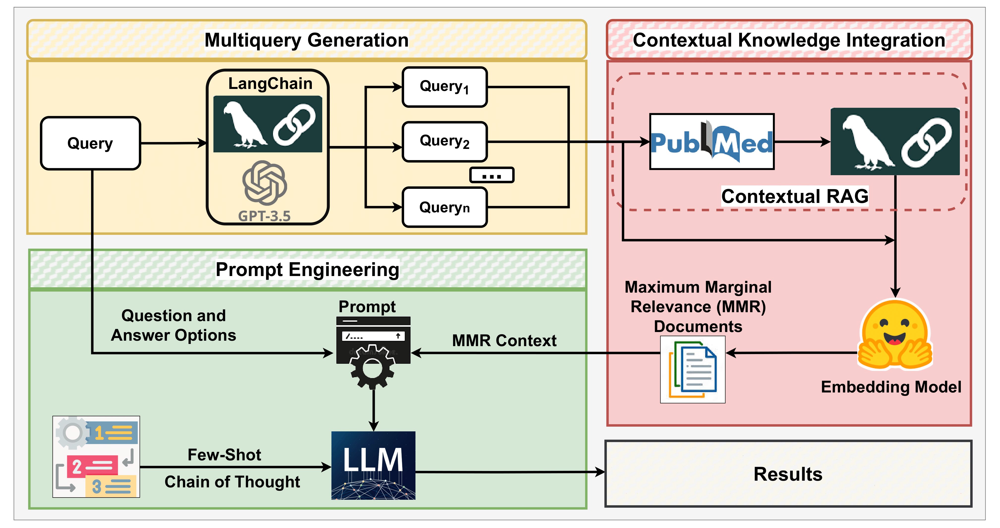
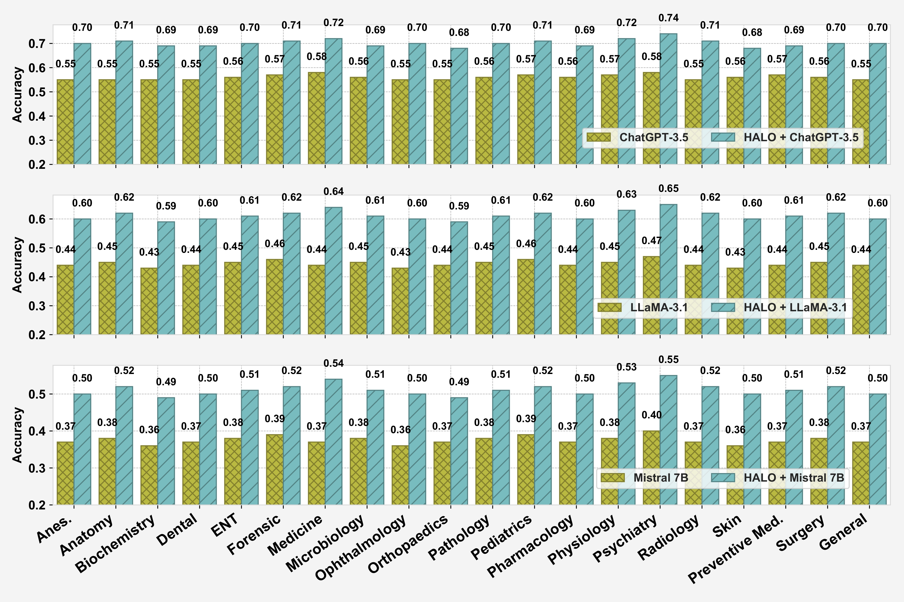

# **HALO: Hallucination Analysis and Learning Optimization to Empower LLMs with Retrieval-Augmented Context for Guided Clinical Decision Making**

# **Abstract**
Large language models (LLMs) have significantly advanced
natural language processing tasks, yet they are susceptible to
generating inaccurate or unreliable responses, a phenomenon
known as hallucination. In critical domains such as health
and medicine, these hallucinations can pose serious risks.
This paper introduces HALO, a novel framework designed
to enhance the accuracy and reliability of medical question-
answering (QA) systems by focusing on the detection and
mitigation of hallucinations. Our approach generates multi-
ple variations of a given query using LLMs and retrieves
relevant information from external open knowledge bases to
enrich the context. We utilize maximum marginal relevance
scoring to prioritize the retrieved context, which is then pro-
vided to LLMs for answer generation, thereby reducing the
risk of hallucinations. The integration of LangChain further
streamlines this process, resulting in a notable and robust in-
crease in the accuracy of both open-source and commercial
LLMs, such as Llama-3.1 (from 44% to 65%) and ChatGPT
(from 56% to 70%). This framework underscores the criti-
cal importance of addressing hallucinations in medical QA
systems, ultimately improving clinical decision-making and
patient care.

Paper: https://arxiv.org/pdf/2409.10011

## HALO Framework

The following diagram illustrates the architecture of the HALO framework:



## Key Features

| Feature | Description |
|---------|-------------|
| **Hallucination Reduction** | Retrieves fact-checked medical context and structures reasoning to minimize false information. |
| **Zero Model Fine-tuning** | Works with frozen commercial and open-source LLMs. |
| **Domain-Specific RAG** | Uses PubMed for trusted, up-to-date medical literature. |
| **MMR Ranking** | Ensures diversity and relevance in retrieved context. |
| **Reasoning Guidance** | Combines few-shot and CoT prompting for better decision-making. |

## Key Results
**Dataset:** MedMCQA (194k medical MCQs across 21 subjects).

The figure below shows HALO’s accuracy improvements across 21 medical subjects in the MedMCQA dataset for three LLMs — **ChatGPT-3.5**, **Llama-3.1 8B**, and **Mistral 7B**.  
Blue bars indicate performance **with HALO**, while green bars show **LLM's accuracy** without HALO.



Consistent accuracy improvements across all 21 subjects.

Notable boosts for smaller models when retrieval is applied.

## Installation
To install the required dependencies, run the following command:

```bash
pip install -r requirements.txt
```

## **Citation**
If you find this work useful, please cite it as follows:

```bibtex
@inproceedings{anjum2025halo,
  title={Halo: Hallucination analysis and learning optimization to empower llms with retrieval-augmented context for guided clinical decision making},
  author={Anjum, Sumera and Zhang, Hanzhi and Zhou, Wenjun and Paek, Eun Jin and Zhao, Xiaopeng and Feng, Yunhe},
  booktitle={2025 IEEE/ACM Conference on Connected Health: Applications, Systems and Engineering Technologies (CHASE)},
  pages={187--198},
  year={2025},
  organization={IEEE}
}
```

## 🙏 **Acknowledgments**

This work was supported in part by the **Microsoft Accelerate Foundation Models Research Grant** and by the **National Institute on Aging (NIA)** under Grant No. **R21AG087192**.  

Research conducted at the [**Responsible AI Lab**](https://responsibleailab.github.io/), University of North Texas.  
